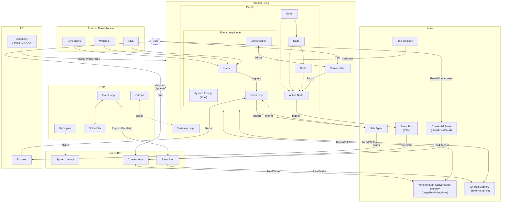

# Product Roadmap

Aden Agent Framework aims to help developers build outcome-oriented, self-adaptive agents. Please find our roadmap here

---

## Core Architecture & Swarm Primitives

### Node-Based Architecture
Implement the core execution engine where every Agent operates as an isolated, asynchronous graph of nodes.

- **Core Node Implementation** *(Stable / Completed)*
    - NodeProtocol with JSON parsing utilities (graph/node.py)
    - EventLoopNode with LLM conversation management (graph/event_loop_node.py)
    - Flexible input/output keys with nullable output handling
    - Node wrapper SDK for agent creation
    - Tool access layer with MCP integration
- **Graph Executor** *(Stable / Completed)*
    - Graph traversal execution (graph/executor.py)
    - Node transition management
    - Error handling and output mapping
    - ExecutionResult with success/error status
- **Shared Memory Access** *(Stable / Completed)*
    - SharedState manager (runtime/shared_state.py)
    - Session-based storage (storage/session_store.py)
    - Isolation levels: ISOLATED, SHARED, SYNCHRONIZED
- **Default Monitoring Hooks** *(Stable / Completed)*
    - Performance metrics collection
    - Resource usage tracking
    - Health check endpoints

### Node Protocol
Build the standard communication protocol for inter-node messaging and data passing.

- **Edge Specifications** *(Stable / Completed)*
    - ALWAYS: Always traverse (graph/edge.py)
    - ON_SUCCESS: Success-based routing
    - ON_FAILURE: Failure-based routing
    - CONDITIONAL: Expression-based routing with safe_eval
    - LLM_DECIDE: Goal-aware LLM-powered routing
- **Event Bus System** *(Stable / Completed)*
    - Full event bus implementation (runtime/event_bus.py)
    - LLM text deltas, tool calls, node transitions
    - Graph-scoped event routing for multi-agent scenarios
- **Conversation Management** *(Stable / Completed)*
    - NodeConversation tracks message history (graph/conversation.py)
    - Tool results, streaming content, metadata support

### Judge in Event Loop
A separate LLM-powered judge to determine if the workers finish their job.

- **Conversation Judge (Level 2)** *(Stable / Completed)*
    - Evaluates node completion against success criteria (graph/conversation_judge.py)
    - Reads recent conversation and assesses quality
    - Returns verdict: ACCEPT or RETRY with confidence scores
- **Test Evaluation Judge** *(Stable / Completed)*
    - Provider-agnostic (OpenAI, Anthropic, Google Gemini) (testing/llm_judge.py)
    - JSON response parsing for structured evaluation
- **Multi-Level Judgment Integration** *(Active / Near-Term Focus)*
    - Judge node integration with event loop
    - Automatic retry logic based on judge verdict
    - Judge performance monitoring

### Swarm Hierarchy
Develop the distinct behavioral logic for the Queen Bee (Orchestrator), Judge Bee (Evaluator), and Worker Bee (Executor).

- **Judge Bee (Evaluator)** *(Stable / Completed)*
    - Evaluation criteria framework (graph/goal.py)
    - Success/failure determination
    - Quality assessment with confidence scores
- **Hive Coder Agent (Builder)** *(Stable / Completed)*
    - Coder node: forever-alive event loop (agents/hive_coder/nodes/)
    - Guardian node: event-driven watchdog for supervised agents
    - Tool discovery (discover_mcp_tools)
    - Agent aware (list_agents, inspect sessions)
    - Post-build testing (run_agent_tests)
    - Debugging capabilities (inspect checkpoints, memory)
- **Queen Bee (Orchestrator)** *(Active / Near-Term Focus)*
    - Multi-agent coordination layer
    - Task distribution logic
    - Dynamic worker agent creation
    - Swarm-level goal management
- **Worker Bee (Executor)** *(Active / Near-Term Focus)*
    - Worker taxonomy definition
    - Worker agent templates
    - Task execution patterns

### Coding Agent Workflows
Implement the Goal Creation Session via the Queen Bee and the dynamic Worker Agent Creation flow.

- **Goal Creation Session** *(Stable / Completed)*
    - Goal object schema definition (graph/goal.py)
    - SuccessCriterion: Measurable success (5+ criteria per goal)
    - Constraint: Hard/soft boundaries (time, cost, safety, scope, quality)
    - GoalStatus: DRAFT → READY → ACTIVE → COMPLETED/FAILED
    - Instruction back and forth in Hive Coder
    - Test case generation
    - Test case validation for worker agent
- **Agent Creation Flow** *(Stable / Completed)*
    - Hive Coder reads templates and discovers tools (builder/package_generator.py)
    - Generates agent.py, nodes/__init__.py, config.py
    - MCP server configuration discovery
    - Dynamic tool binding
- **Worker Agent Dynamic Creation** *(Active / Near-Term Focus)*
    - Template agent initialization from Queen Bee
    - Runtime worker instantiation
    - Worker lifecycle management

### Security Layer
Build robust, local Credential Management interfaces for secure API key handling.

- **Unified Credential Store** *(Stable / Completed)*
    - Multi-backend storage (credentials/store.py)
    - EncryptedFileStorage: Encrypted local storage (~/.hive/credentials)
    - EnvVarStorage: Environment variable mapping
    - InMemoryStorage: Testing
    - HashiCorp Vault: Enterprise secrets (credentials/storage.py)
    - Template resolution: `{{cred.key}}` patterns
    - Caching with TTL (default 5 min, configurable)
    - Thread-safe operations with RLock
- **OAuth2 Providers** *(Stable / Completed)*
    - Base provider pattern (credentials/oauth2/)
    - HubSpot provider integration
    - Lifecycle management (refresh tokens)
    - Browser opening for auth flows (tools/credentials/browser.py)
- **Aden Sync Provider** *(Stable / Completed)*
    - Syncs OAuth2 tokens from Aden authentication server (credentials/aden/)
    - Falls back to local storage if Aden unavailable
    - Auto-refresh on sync
- **Enterprise Secret Managers** *(Active / Near-Term Focus)*
    - AWS Secrets Manager integration
    - Azure Key Vault integration
    - Audit logging for compliance/tracking
    - Per-environment configuration support

---

## Tooling Ecosystem & General Compute

### Sub-agents Parallel Execution
Develop the Sub-agent execution environment for parallel tasks execution. The subagents are designed with isolation for repeatability.

- **Multi-Graph Sessions** *(Stable / Completed)*
    - Load multiple agent graphs in single session (runtime/agent_runtime.py)
    - Shared state between graphs
    - Independent execution streams
    - Graph lifecycle management (load/unload/start/restart)
- **Concurrent Execution Management** *(Stable / Completed)*
    - Max concurrent executions configuration
    - Isolation levels: isolated, shared, synchronized
- **Sub-agent Execution Environment** *(Active / Near-Term Focus)*
    - Isolated sub-agent runtime environment
    - Task isolation mechanisms
    - Result aggregation
    - Error handling for parallel tasks
    - Repeatability guarantees

### Browser Use Node
Implement native browser-integrated automation so agents can take over a browser for auth and agents perform the automation jobs. This node comes with a specific set of tools and system prompts.

- **Web Scraping with Playwright** *(Stable / Completed)*
    - Headless Chromium launch (tools/web_scrape_tool/)
    - Stealth mode via playwright_stealth
    - JavaScript rendering with wait-for-domcontentloaded
    - CSS selector support
    - User-agent spoofing
    - Sandbox/automation detection evasion
- **Browser Launch Utilities** *(Stable / Completed)*
    - Platform-specific browser opening (macOS/Linux/Windows) (tools/credentials/browser.py)
    - OAuth2 flow integration
- **Full Browser Use Node** *(Active / Near-Term Focus)*
    - Multi-page automation workflows
    - Form filling with vision-guided interactions
    - Interactive screenshot capabilities
    - Session management across navigations
    - Browser-specific tool set
    - System prompts for browser tasks

### Core Graph Framework Infra
Ship essential framework utilities: Node validation, HITL (Human-in-the-loop pause/approve), and node lifecycle management.

- **Node Validation** *(Stable / Completed)*
    - Pydantic-based validation
    - Schema enforcement
    - Output key validation (Level 0)
- **Human-in-the-Loop (HITL)** *(Stable / Completed)*
    - HITLRequest and HITLResponse protocol (graph/hitl.py)
    - Question types: FREE_TEXT, STRUCTURED, SELECTION, APPROVAL, MULTI_FIELD
    - Haiku-powered response parsing
    - User-friendly display formatting
    - Pause/approve workflow
    - State saved to checkpoint
    - Resume with HITLResponse merged into context
- ~~**TUI Integration** *(Deprecated)*~~
    - Chat REPL with streaming support (tui/app.py)
    - Multi-graph session management
    - User presence detection
    - Real-time log viewing
- **Node Lifecycle Management** *(Stable / Completed)*
    - Start/stop/pause/resume in execution stream
    - State persistence via checkpoint store
    - Recovery mechanisms with checkpoint restore
- **Advanced HITL Features** *(Active / Near-Term Focus)*
    - Callback handlers for custom intervention logic
    - Streaming interface for real-time monitoring
    - Approval workflows at scale

### Infrastructure Tools
Port popular tools, and build out the Runtime Log, Audit Trail, Excel, and Email integrations.

- **File Operations (36+ tools)** *(Stable / Completed)*
    - read_file, write_file, edit_file (builder/package_generator.py)
    - list_directory, search_files
    - apply_diff / apply_patch for code modification (tools/file_system_toolkits/)
    - data_tools (CSV/Excel parsing)
- **Web Tools** *(Stable / Completed)*
    - Web Search (tools/web_search_tool/)
    - Web Scraper (tools/web_scrape_tool/)
    - Exa Search (tools/exa_search_tool/)
    - News Tool (tools/news_tool/)
    - SerpAPI (tools/serpapi_tool/)
- **Data Tools** *(Stable / Completed)*
    - CSV tools (tools/csv_tool/)
    - Excel tools (tools/excel_tool/)
    - PDF tools (tools/pdf_read_tool/)
    - Vision tool for image analysis (tools/vision_tool/)
    - Time tool (tools/time_tool/)
- **Communication Tools (8 tools)** *(Stable / Completed)*
    - Email tool (tools/email_tool/)
    - Gmail tool (tools/gmail_tool/)
    - Slack tool (tools/slack_tool/)
    - Discord tool (tools/discord_tool/)
    - Telegram tool (tools/telegram_tool/)
    - Google Docs (tools/google_docs_tool/)
    - Google Maps (tools/google_maps_tool/)
    - Cal.com (tools/calcom_tool/)
- **CRM/API Integrations (5+ tools)** *(Stable / Completed)*
    - HubSpot (tools/hubspot_tool/)
    - GitHub (tools/github_tool/)
    - Apollo (tools/apollo_tool/)
    - BigQuery (tools/bigquery_tool/)
    - Razorpay (tools/razorpay_tool/)
    - Calendar (tools/calendar_tool/)
- **Security/Scanning Tools (5 tools)** *(Stable / Completed)*
    - DNS Security Scanner (tools/dns_security_scanner/)
    - SSL/TLS Scanner (tools/ssl_tls_scanner/)
    - Port Scanner (tools/port_scanner/)
    - Subdomain Enumerator (tools/subdomain_enumerator/)
    - Tech Stack Detector (tools/tech_stack_detector/)
- **Runtime & Logging** *(Stable / Completed)*
    - Runtime Log Tool (tools/runtime_logs_tool/)
    - Runtime Logger with L1/L2/L3 levels (runtime/runtime_logger.py)
- **Audit Trail System** *(Active / Near-Term Focus)*
    - Decision tracing beyond logs
    - Compliance reporting
    - Historical query capabilities

---

## Memory, Storage & File System Capabilities

### Memory Tools
Simple pure file-based memory management

- **Short-Term Memory (STM)** *(Stable / Completed)*
    - SharedState manager for in-memory state (runtime/shared_state.py)
    - Session-based storage (storage/session_store.py)
    - State-based short-term memory layer
- **Conversation Memory** *(Stable / Completed)*
    - NodeConversation tracks message history (graph/conversation.py)
    - Tool results, streaming content, metadata
    - Context building for LLM prompts
- **Long-Term Memory (LTM)** *(Active / Near-Term Focus)*
    - Semantic indexing for memory retrieval
    - RLM (Retrieval-augmented Long-term Memory) implementation
    - Memory persistence beyond session
    - Content-based memory search

### Durable Scratchpad
Integrate a lightweight, persistent DB for long-term memory using the filesystem-as-scratchpad pattern.

- **Filesystem as Scratchpad** *(Stable / Completed)*
    - File-based persistence layer (storage/)
    - Session store implementation
    - Data durability guarantees
- **Checkpoint System** *(Stable / Completed)*
    - Save/restore execution state (storage/checkpoint_store.py)
    - TTL-based cleanup
    - Async checkpoint support
    - Max age configuration
- **Message Model & Session Management** *(Active / Near-Term Focus)*
    - Message class with structured content types
    - Session classes for conversation state
    - Per-message file persistence
    - Migration from monolithic run storage

### Memory Isolation
Enforce session-local memory isolation to prevent data bleed between concurrent agent runs.

- **Session Isolation** *(Stable / Completed)*
    - Session-local memory implementation (storage/session_store.py)
    - Data bleed prevention
    - Concurrent run safety
    - Isolation levels: ISOLATED, SHARED, SYNCHRONIZED
- **State Management** *(Stable / Completed)*
    - SharedState with thread-safe operations (runtime/shared_state.py)
    - Session-scoped state access
- **Context Management** *(Active / Near-Term Focus)*
    - Message.stream(sessionID) implementation
    - Full context building optimization
    - Message to model conversion improvements

### Agent Capabilities
Implement File I/O support, streaming mode, and allow users to supply custom functions as libraries/nodes.

- **File I/O** *(Stable / Completed)*
    - File read/write operations (builder/package_generator.py)
    - File system navigation
    - Directory listing and search
- **Execution Streaming** *(Stable / Completed)*
    - Real-time event streaming (runtime/execution_stream.py)
    - Token-by-token output via event bus
    - Tool call streaming
- **Custom Tool Integration** *(Stable / Completed)*
    - MCP server discovery (builder/package_generator.py)
    - Dynamic tool binding
    - Custom tool registration
- **Streaming Mode Enhancements** *(Active / Near-Term Focus)*
    - Progressive result delivery optimization
    - Backpressure handling
- **Custom Function Libraries** *(Active / Near-Term Focus)*
    - User-supplied function libraries as nodes
    - Library versioning and management
- **Proactive Memory Compaction** *(Active / Near-Term Focus)*
    - Overflow detection
    - Backward-scanning pruning strategy
    - Token tracking integration for compaction decisions

### File System Enhancements
Add semantic search capabilities and an interactive file system for frontend product integration.

- **File Search** *(Stable / Completed)*
    - search_files tool (builder/package_generator.py)
    - Directory traversal
- **Semantic Search** *(Active / Near-Term Focus)*
    - Semantic indexing of files
    - Natural language file search
    - Content-based retrieval with embeddings
- **Interactive File System** *(Active / Near-Term Focus)*
    - Frontend file browser integration
    - Real-time file system updates
    - Visual file navigation in GUI

---

## Eval System, DX, & Open Source Guardrails

### Eval System
Build the failure recording mechanism and an SDK for defining custom failure conditions.

- **Multi-Level Evaluation** *(Stable / Completed)*
    - Level 0: Output key validation (all required keys set)
    - Level 1: Literal checks (output_contains, output_equals)
    - Level 2: Conversation-aware judgment (graph/conversation_judge.py)
- **Goal-Based Constraints** *(Stable / Completed)*
    - Hard constraints (violation = failure) (graph/goal.py)
    - Soft constraints (prefer not to violate)
    - Categories: time, cost, safety, scope, quality
    - Constraint checking infrastructure
- **Success Criteria Definition** *(Stable / Completed)*
    - Weighted criteria (0.0-1.0)
    - Metrics: output_contains, output_equals, llm_judge, custom
    - 90% threshold for goal success
- **Test Framework** *(Stable / Completed)*
    - TestCase, TestResult, TestStorage classes (testing/)
    - LLM-based judgment for semantic evaluation (testing/llm_judge.py)
    - Approval CLI for manual approval workflows
    - Categorization and test result reporting
- **Failure Recording** *(Active / Near-Term Focus)*
    - Failure capture mechanism
    - Failure analysis tools
    - Historical failure tracking
    - Continuous improvement loop
- **Custom Failure Conditions SDK** *(Active / Near-Term Focus)*
    - SDK for defining custom failure conditions
    - Custom evaluator framework extension
    - Condition validation DSL

### Guardrails SDK
Implement deterministic condition guardrails directly in the node, complete with mitigation tracking and audit logs.

- **Goal Constraints (Basic Guardrails)** *(Stable / Completed)*
    - Hard/soft constraint definitions (graph/goal.py)
    - Constraint checking in goals
- **Deterministic Guardrails SDK** *(Active / Near-Term Focus)*
    - In-node guardrail implementation
    - Condition-based guardrails
    - Guardrail SDK for custom rules
- **Monitoring & Tracking** *(Active / Near-Term Focus)*
    - Mitigation tracking for violations
    - Audit log system for guardrails
    - Compliance reporting
- **Basic Monitoring Hooks** *(Active / Near-Term Focus)*
    - Agent node SDK monitoring hooks
    - Event hook system for guardrails
    - Default monitoring hooks in nodes

### DevTools CLI
Release CLI tools specifically for rapid memory management and credential store editing.

- **Main CLI** *(Stable / Completed)*
    - Run, info, validate, list commands (cli.py)
    - Dispatch mode for batch execution
    - Shell mode for interactive use
    - Model selection configuration
- **Testing CLI** *(Stable / Completed)*
    - test-run, test-debug, test-list, test-stats (testing/cli.py)
    - Pytest integration
    - Test categorization
- ~~**TUI (Terminal UI)** *(Deprecated)*~~
    - Interactive chat with streaming (tui/app.py)
    - Multi-graph management UI
    - Log pane for real-time output
    - Keyboard shortcuts (Ctrl+C, Ctrl+D, etc.)
- **Memory Management CLI** *(Active / Near-Term Focus)*
    - Memory inspection commands
    - Memory cleanup utilities
    - Session management commands
- **Credential Store CLI** *(Active / Near-Term Focus)*
    - Interactive credential editing
    - Secure credential viewer
    - Credential validation tools
- **Debugging Tools** *(Active / Near-Term Focus)*
    - Interactive debugging mode beyond TUI
    - Breakpoint support in execution
    - Step-through execution

### Observability
Support user-driven log analysis, basic monitoring hooks from the SDK, and an interactive debugging mode.

- **Runtime Logging** *(Stable / Completed)*
    - L1 (summary), L2 (detailed), L3 (tool) logging levels (runtime/runtime_logger.py)
    - Session logs directory storage
    - Audit trail for decision tracing in logs
- **Event Bus Monitoring** *(Stable / Completed)*
    - Real-time event streaming (runtime/event_bus.py)
    - LLM text deltas, tool calls, node transitions
    - Graph-scoped event routing
- **Log Analysis Tools** *(Active / Near-Term Focus)*
    - User-driven log analysis (OSS approach)
    - Log aggregation utilities
    - Log visualization tools
- **Monitoring Hooks** *(Active / Near-Term Focus)*
    - Basic observability hooks from SDK
    - Performance metrics collection
    - Health checks system
- **Token Tracking** *(Active / Near-Term Focus)*
    - Reasoning token tracking
    - Cache token tracking
    - Token metrics in compaction logic

### Developer Success
Write the Quick Start guide, detailed tool usage documentation, and set up the MVP README examples.

- **Documentation** *(Stable / Completed)*
    - Quick start guide
    - Goal creation guide
    - Agent creation guide
    - README with examples
    - Contributing guidelines
    - GitHub Page setup
- **Tool Usage Documentation** *(Stable / Completed)*
    - Comprehensive tool documentation
    - Tool integration examples
    - Best practices guide
- **Video Content** *(Active / Near-Term Focus)*
    - Introduction video
    - Tutorial videos
- **Example Agents** *(Active / Near-Term Focus)*
    - Knowledge agent template
    - Blog writer agent template
    - SDR agent template

---

## Deployment, CI/CD & Community Templates

### Self-Deployment
Standardize the Docker container builds and establish headless backend execution APIs.

- **Docker Support** *(Stable / Completed)*
    - Python 3.11-slim base image (tools/Dockerfile)
    - Playwright Chromium installation
    - Non-root user for security
    - Health check endpoint
    - Volume mount for workspace persistence
    - Exposes port 4001 for MCP server
- **Agent Runtime** *(Stable / Completed)*
    - AgentRuntime: Top-level orchestrator (runtime/agent_runtime.py)
    - Multiple entry points (manual, webhook, timer, event, api)
    - Concurrent execution management
    - State persistence via session store
    - Outcome aggregation
- **Async Entry Points** *(Stable / Completed)*
    - AsyncEntryPointSpec: Webhook, timer, event triggers (graph/edge.py)
    - Timer config: cron expressions or interval_minutes
    - Event triggers for custom events
    - Isolation levels: isolated, shared, synchronized
- **Headless Backend Enhancements** *(Active / Near-Term Focus)*
    - Standardized backend execution APIs
    - Frontend attachment interface
    - Self-hosted setup guide with examples

### Lifecycle APIs
Expose basic REST/WebSocket endpoints for external control (Start, Stop, Pause, Resume).

- **Webhook Server** *(Stable / Completed)*
    - FastAPI-based webhook server (runtime/webhook_server.py)
    - Route configuration per entry point
    - Optional secret validation
- **Graph Lifecycle Management** *(Stable / Completed)*
    - Load/unload/start/restart in AgentRuntime
    - State persistence
    - Recovery mechanisms
- **REST API Endpoints** *(Stable / Completed)*
    - Start endpoint for agent execution
    - Stop endpoint for graceful shutdown
    - Pause endpoint for execution suspension
    - Resume endpoint for continuation
    - Status query endpoint for monitoring
- **WebSocket API** *(Active / Near-Term Focus)*
    - Real-time event streaming to clients
    - Bidirectional communication
    - Connection management with reconnection

### CI/CD Pipelines
Implement automated test execution, agent version control, and mandatory test-passing for deployment.

- **Test Execution** *(Stable / Completed)*
    - Test framework with pytest integration (testing/)
    - Test result reporting
    - Test CLI commands (test-run, test-debug, etc.)
- **Automated Testing Pipeline** *(Stable / Completed)*
    - CI integration (GitHub Actions, etc.)
    - Mandatory test-passing gates
    - Coverage reporting
- **Version Control** *(Active / Near-Term Focus)*
    - Agent versioning system
    - Semantic versioning for agents
    - Version compatibility checks
- **Deployment Automation** *(Active / Near-Term Focus)*
    - Continuous deployment pipeline
    - Rollback mechanisms
    - Blue-green deployment support

### Distribution
Launch the official PyPI package, Docker Hub image, and the community Discord channel.

- **Package Distribution** *(Active / Near-Term Focus)*
    - Official PyPI package
    - Docker Hub image publication
    - Version release automation
    - Installation documentation
- **Community Channels** *(Active / Near-Term Focus)*
    - Discord channel setup
    - Community support structure
    - Contribution guidelines enforcement
- **Cloud Deployment** *(Active / Near-Term Focus)*
    - AWS Lambda integration
    - GCP Cloud Functions support
    - Azure Functions support
    - 3rd-party platform integrations
    - Self-deploy with orchestrator connection

### Example Agents
Ship ~20 ready-to-use templates including GTM Sales, Marketing, Analytics, Training, and Smart Entry agents.

- **Hive Coder Agent** *(Stable / Completed)*
    - Agent builder template (agents/hive_coder/)
    - Guardian node for supervision
- **Sales & Marketing Agents** *(Active / Near-Term Focus)*
    - GTM Sales Agent (workflow automation)
    - GTM Marketing Agent (campaign management)
    - Lead generation agent
    - Email campaign agent
    - Social media agent
- **Analytics & Insights Agents** *(Active / Near-Term Focus)*
    - Analytics Agent (data analysis)
    - Data processing agent
    - Report generation agent
    - Dashboard agent
- **Training & Education Agents** *(Active / Near-Term Focus)*
    - Training Agent (onboarding)
    - Content creation agent
    - Knowledge base agent
    - Documentation agent
- **Automation & Forms Agents** *(Active / Near-Term Focus)*
    - Smart Entry / Form Agent (self-evolution emphasis)
    - Data validation agent
    - Workflow automation agent
    - Integration agent
- **Additional Templates** *(Active / Near-Term Focus)*
    - Customer support agent
    - Document processing agent
    - Scheduling agent
    - Research agent
    - Code review agent

---

## Open Hive

### Local API Gateway
Build a lightweight local server (e.g., FastAPI or Node) that securely exposes the Hive framework's core Event Bus and Memory Layer to the local browser environment.

- **MCP Server Foundation** *(Stable / Completed)*
    - FastMCP server implementation (builder/package_generator.py)
    - Agent builder tools exposed
    - Port 4001 exposed in Docker
- **Event Bus Architecture** *(Stable / Completed)*
    - Event Bus implementation (runtime/event_bus.py)
    - Real-time event streaming
    - Graph-scoped event routing
- **Local API Gateway** *(Active / Near-Term Focus)*
    - Lightweight local server (FastAPI or Node)
    - Secure authentication layer for browser
    - CORS and security configuration
    - Event Bus API endpoints for browser access
    - Event subscription management for frontend
- **Memory Layer API** *(Active / Near-Term Focus)*
    - Memory read/write endpoints
    - Session management API for frontend
    - Memory visualization data endpoints

### Visual Graph Explorer
Implement an interactive, drag-and-drop canvas (using libraries like React Flow) to visualize the Worker Graph, Queen Bee, and active execution paths in real-time.

- **Graph Visualization** *(Active / Near-Term Focus)*
    - React Flow integration
    - Worker Graph rendering from agent definitions
    - Node type visualization (EventLoop, Function, etc.)
    - Edge visualization with condition types
    - Active execution path highlighting
- **Interactive Features** *(Active / Near-Term Focus)*
    - Drag-and-drop canvas for graph editing
    - Node editing capabilities
    - Real-time graph updates during execution
    - Zoom and pan controls
    - Node inspection on click
- **Integration with Runtime** *(Active / Near-Term Focus)*
    - Live execution visualization
    - Node state indicators
    - Edge traversal animation

### TUI to GUI Upgrade
Port the existing Terminal User Interface (TUI) into a rich web application, allowing users to interact directly with the Queen Bee / Coding Agent via a browser chat interface.

> **Note:** The TUI (`hive tui` / `tui/app.py`) is deprecated and no longer maintained (see AGENTS.md). The items below reflect legacy work completed before deprecation. New development should target the browser-based GUI (`hive open`).

- ~~**TUI Foundation** *(Deprecated)*~~
    - Terminal chat interface (tui/app.py)
    - Streaming support
    - Multi-graph management
    - Log pane display
    - Keyboard shortcuts
- **Web Application** *(Active / Near-Term Focus)*
    - Modern web UI framework setup (React/Vue/Svelte)
    - Responsive design implementation
    - Cross-browser compatibility
- **Chat Interface** *(Active / Near-Term Focus)*
    - Browser-based chat UI
    - Hive Coder interaction (Queen Bee proxy)
    - Coding Agent interface
    - Message history and search
    - Rich message formatting (markdown, code blocks)
- **TUI Feature Parity** *(Active / Near-Term Focus)*
    - All TUI commands in GUI
    - Keyboard shortcuts in browser
    - Command palette (Cmd+K style)

### Memory & State Inspector
Create a UI component to inspect the Shared Memory and Write-Through Conversation Memory, allowing developers to click on any node and see exactly what it is thinking.

- **Runtime Logs Tool** *(Stable / Completed)*
    - Inspect agent session logs (tools/runtime_logs_tool/)
    - Session state retrieval (builder/package_generator.py)
- **Memory Inspector UI** *(Active / Near-Term Focus)*
    - Shared Memory visualization
    - Conversation memory view (NodeConversation display)
    - Memory search and filter
    - Memory timeline view
- **Node State Inspection** *(Active / Near-Term Focus)*
    - Click-to-inspect functionality
    - Node thought process display (LLM reasoning)
    - State history timeline per node
    - Input/output inspection
- **Debug Tools** *(Active / Near-Term Focus)*
    - Memory diff viewer (state changes between nodes)
    - State snapshot comparison
    - Memory leak detection

### Local Control Panel
Build a dashboard for localized Credential Management (editing the ~/.hive/credentials store safely) and swarm lifecycle management (Start, Pause, Kill, and HITL approvals).

- **Credential Management Backend** *(Stable / Completed)*
    - CredentialStore with file/env/vault backends (credentials/store.py)
    - OAuth2 provider support (credentials/oauth2/)
    - Template resolution and caching
- **Credential Management Dashboard** *(Active / Near-Term Focus)*
    - Safe credential editing interface (web UI)
    - ~/.hive/credentials store management UI
    - Credential validation and testing UI
    - Encryption status display
    - OAuth2 flow initiation from browser
- **Swarm Lifecycle Management** *(Active / Near-Term Focus)*
    - Start/Stop controls for agents
    - Pause/Resume functionality
    - Kill process management
    - HITL approval interface in browser
    - Multi-agent orchestration view
- **Monitoring Dashboard** *(Active / Near-Term Focus)*
    - Active agents display
    - Resource usage monitoring (CPU, memory, tokens)
    - Performance metrics visualization
    - Execution history

### Local Model Integration
Build native frontend configurations to easily connect Open Hive's backend to local open-source inference engines like Ollama, keeping the entire stack offline and private.

- **LLM Integration Layer** *(Stable / Completed)*
    - Provider-agnostic LLM support via LiteLLM (graph/event_loop_node.py)
    - Model configuration in agent definitions
- **Local Model Support** *(Active / Near-Term Focus)*
    - Ollama integration and configuration
    - Local LLM configuration UI
    - Model selection and management dashboard
    - Model performance monitoring
- **Offline Mode** *(Active / Near-Term Focus)*
    - Full offline functionality (no cloud API calls)
    - Local-only execution mode flag
    - Privacy-first architecture enforcement
    - Local model fallback mechanisms
- **Model Configuration** *(Active / Near-Term Focus)*
    - Easy model switching in UI
    - Model parameter tuning (temperature, top_p, etc.)
    - Performance optimization settings
    - Multi-model support (different models per node)
    - Model cost tracking for local models

### Cross-Platform Support
- **JavaScript/TypeScript SDK** *(Active / Near-Term Focus)*
    - TypeScript SDK development
    - npm package distribution
    - Node.js runtime support
    - Browser runtime support
- **Platform Compatibility** *(Active / Near-Term Focus)*
    - Windows support improvements
    - macOS optimization
    - Linux distribution support

### Coding Agent Integration
- **IDE Integrations** *(Active / Near-Term Focus)*
    - Claude Code integration
    - Cursor integration
    - Opencode integration
    - Antigravity integration
    - Codex CLI integration (in progress)
